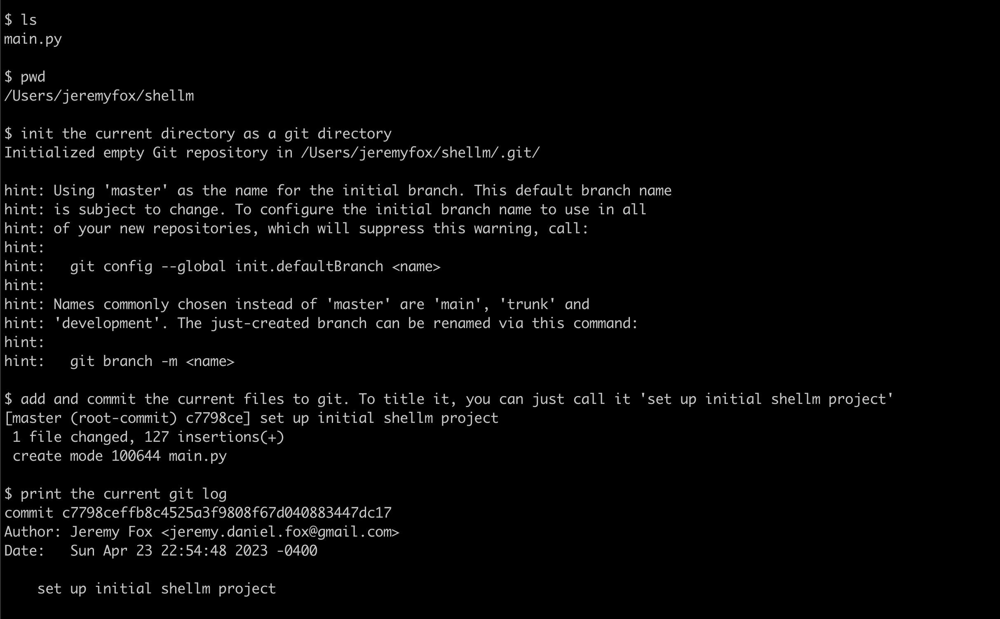
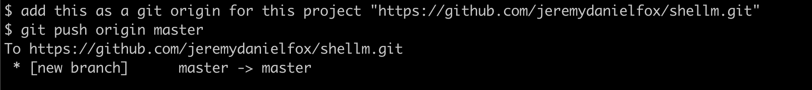
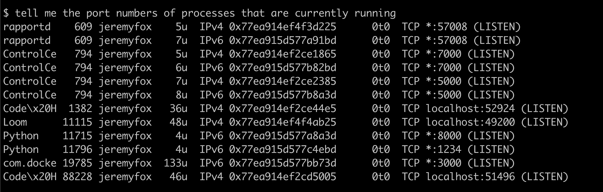
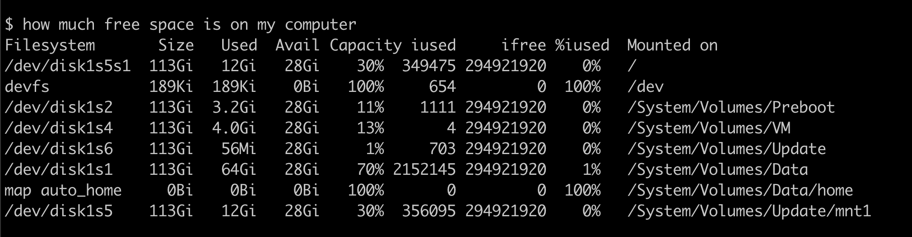
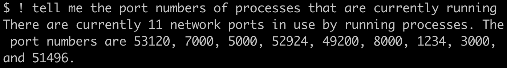
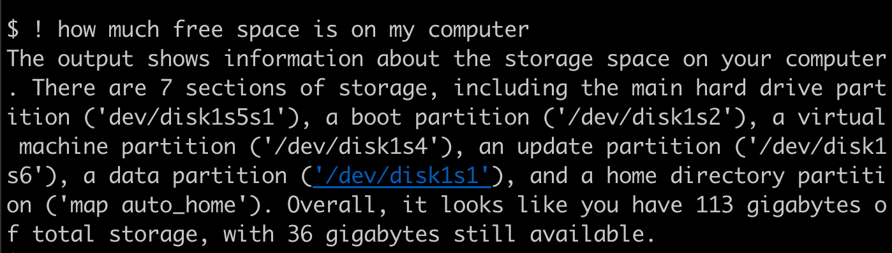
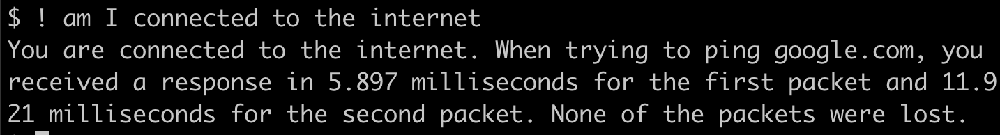

# Shellm
## An LLM-based shell for Bash.

Shellm (pronounced Shell-LM) is simple LLM-based shell interface. It lets you input commands to Bash in natural language, which then get translated to Bash commands via an LLM and executed normally.

Here is me using Shellm to push Shellm to Github:

You can use Shellm to run commands that you might not always remember:

Sometimes, the command output can be hard to understand (like in the two examples above). If you prefix your command with `!`, then Shellm will use an LLM to present your output in an easy to understand way:

This lets you do all sorts of fun stuff!

## Contact
Feel free to connect with me on Twitter (I'm [@jeremydanielfox](https://twitter.com/jeremydanielfox)).